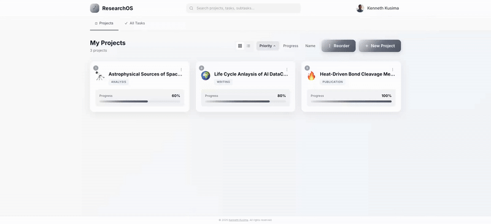
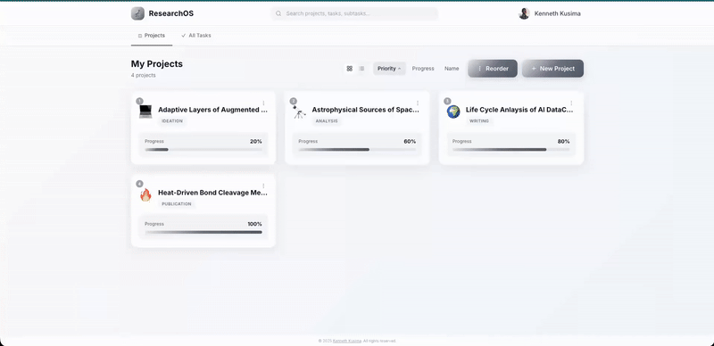

# HypotheSys™ 🔬

*Systematizing your way from hypothesis to discovery*

A modern, collaborative research project management application designed for researchers, academics, and teams working on complex projects.

📄 **Github Pages**: [https://kkusima.github.io/hypothesys/](https://kkusima.github.io/hypothesys/)

🔗 **Live WebApp**: [hypothesys.vercel.app](https://hypothesys.vercel.app/)

### 🖥️  Desktop Apps 
Get the native experience for your workstation:
*   🍎 **macOS**: [Download zipped .dmg](https://github.com/kkusima/hypothesys/releases/download/v1.0.0/HypotheSys_Mac_v1.0.0.zip) (~180 MB)
*   🪟 **Windows**: [Download zipped .exe](https://github.com/kkusima/hypothesys/releases/download/v1.0.0/HypotheSys_Windows_v1.0.0.zip) (~80 MB)

## What is HypotheSys™?

HypotheSys™ is a lightweight project management tool built specifically for research workflows. Created to address the pain point of needing a simple, practical tool for everyday research work, it allows users to create projects, collaborate in shared workspaces, and keep project information synchronized in real time, without unnecessary complexity. The tool is free to use and focuses on a straightforward, intuitive UI that centralizes tasks and project data to support core research workflows in a single interface.

## Key Features

- **📁 Project Organization** — Create projects with custom emojis, descriptions, and flexible stage-based workflows
- **✅ Task Management** — Break down work into tasks and subtasks with progress tracking
- **👥 Team Collaboration** — Share projects with collaborators via email or invite links
- **🔄 Drag & Drop Reordering** — Prioritize projects with intuitive drag-and-drop
- **📊 Sorting & Filtering** — Sort by date, alphabetically, or by progress (ascending/descending)
- **🔐 Google Sign-In** — Secure authentication with your Google account
- **☁️ Cloud Sync** — Data stored securely in Supabase with real-time sync
- **📱 Responsive Design** — Works seamlessly on desktop and mobile

## Use Cases

- **Academic Research** — Track experiments, literature reviews, and paper submissions
- **Thesis/Dissertation** — Organize chapters, deadlines, and advisor feedback
- **Lab Projects** — Coordinate team members across multiple concurrent studies
- **Grant Applications** — Manage timelines and deliverables
- **Personal Learning** — Structure self-directed learning projects

## Tech Stack

- **Frontend**: React + Vite + Tailwind CSS
- **Backend**: Supabase (PostgreSQL + Auth + Real-time)
- **Hosting**: Vercel
- **Desktop App Development**: Electron

## License

MIT License

---

## Trademark Notice

**HypotheSys™** is a trademark. The name and associated branding are proprietary. Use of the HypotheSys™ name, or branding for derivative works or commercial purposes requires prior written permission.

---

HypotheSys™ © 2026 [Kenneth Kusima](http://tinyurl.com/kennethkusima). All rights reserved.
